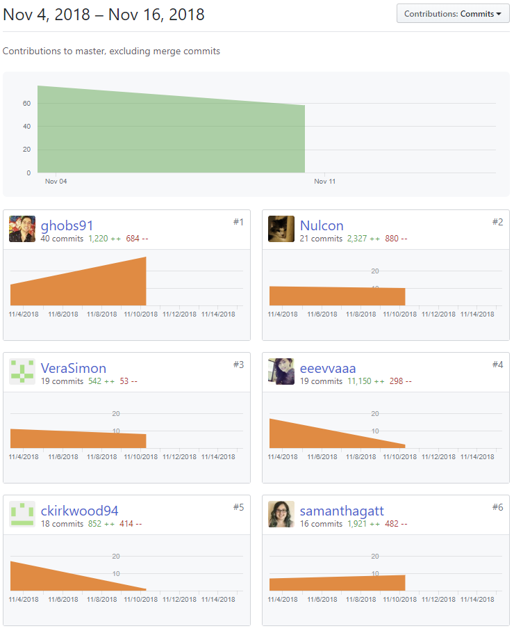

Part 1 - Individual Accomplishments this Week

###

Paste your team’s github contribution graph here and indicate your Github Handle:
https://github.com/Lambda-School-Labs/Labs8-OfflineReader/graphs/contributors

Provide a paragraph (5-8 sentences) summarizing the work you did this week, the challenges you faced, the tools you used, and your accomplishments
This week is mostly laying down the foundation for the project.

###

Started the week fixing up some front end codes. Changed the type of password input field from text to password so that when users are typing their password, it would not be exposed. Then we went into a group meeting debugging our backend code so that it would not have any merge conflict and
Followed Github guide to quickly set up the repository.
Added MIT license to the repo.
Set up fronend folder and file structure as well as built out Sign In page and Sign Up page placeholders.
Researched and participated in debug session for backend settings and deployment for Django app.
Contributed to the discussion of tech stack. Getting conversation started and facilitated Zoom meetings when needed.

###

Tasks Pulled

List the tasks you pulled this week, and provide a link to the successfully merged PR completing that task and the trello card for that task. You must have at least one front end and one back end. The expected total is 6 with a minimum of 4.

####

- Ticket 1 Stripe Frontend
  - [Github](https://github.com/Lambda-School-Labs/Labs8-OfflineReader/pull/54)
  - [Trello](https://trello.com/c/zseKxoGT)
- Ticket 2 Frontend refactoring
  - [Github](https://github.com/Lambda-School-Labs/Labs8-OfflineReader/pull/36)
  - [Trello](https://trello.com/c/m0RxV7YH)

####

- Ticket 1 Dev Server Debug

  - [Github](https://github.com/Lambda-School-Labs/Labs8-OfflineReader/pull/35)
  - [Trello](https://trello.com/c/RiyoyRZL)

- Ticket 2 Pages/article GET POST

  - [Github](https://github.com/Lambda-School-Labs/Labs8-OfflineReader/pull/45)
  - [Trello](https://trello.com/c/jPkBbuV6)

- Ticket 3 Stripe Backend (WIP)
  - [Github Branch](https://github.com/Lambda-School-Labs/Labs8-OfflineReader/tree/feature/stripe-api)
  - [Trello](https://trello.com/c/F0ETpiH1)

###

Detailed Analysis

Pick one of your tickets and provide a detailed analysis of the work you did. This should be approximately ¼ page of text, and at least three screenshots.

###

Ticket 2 Pages/article GET POST

###

It has been a huge learning curve with Django REST API implementation. I struggle with finding reference from what I already know and relate to what I am learning. I was able to log in to the account and make GET and POST request, however, I was not able to figured out the GET BY ID, POST, and DELETE requests due to they all need to target the id of the specific article.

###

Part 2 - Milestone Reflections

Put your response to the weekly question and a link to your team journal assignment here.

- https://docs.google.com/document/d/1XzUVkLkvUvksw3nAFLcz3RKa7zGzvaUsoksuTKDHjdU/edit?ts=5be2f8bd
- https://anywhere-reader-test.netlify.com/
- https://anywhere-reader-test.herokuapp.com

###

[Whiteboard Interview: Matrix Spiral](https://youtu.be/i6hJDEInahE)
