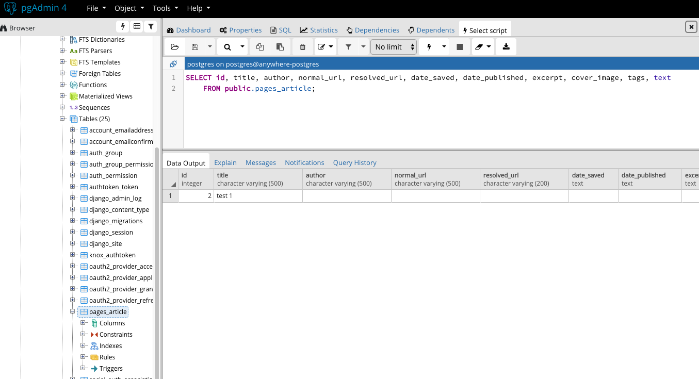

Part 1 - Individual Accomplishments this Week

###

Paste your team’s github contribution graph here and indicate your Github Handle:
https://github.com/Lambda-School-Labs/Labs8-OfflineReader/graphs/contributors

Provide a paragraph (5-8 sentences) summarizing the work you did this week, the challenges you faced, the tools you used, and your accomplishments

###

It's been a busy week this week. Not only did we need to catch up with the work in progress MVPs from week 2, we need to get our core functionality up and running by the end of the week.
The check in with Brain on Monday afternoon put a lot of things in perspective. We needed to have the data structure locked down and have the scraper function finished. Our challenges were offlince storage, authentication, and connecting the scraper function to pages_article table and frontend. Everything is coming together slowly but surely.

###

Tasks Pulled

List the tasks you pulled this week, and provide a link to the successfully merged PR completing that task and the trello card for that task. You must have at least one front end and one back end. The expected total is 6 with a minimum of 4.

#### Frontend

- Ticket 1 Stripe frontend ascyn optimization
  - [Github](https://github.com/Lambda-School-Labs/Labs8-OfflineReader/pull/70)
  - [Trello](https://trello.com/c/5JWLs6Rr)

#### Backend

- Ticket 1 Create Articles models

  - [Github](https://github.com/Lambda-School-Labs/Labs8-OfflineReader/pull/79)
  - [Trello](https://trello.com/c/nyy1KXJH)

- Ticket 2 Stripe API refactor and resolve merge conflicts

  - [Github](https://github.com/Lambda-School-Labs/Labs8-OfflineReader/pull/64)
  - [Trello](https://trello.com/c/ePP18GFt)

- Ticket 3 Pages GET and POST endpoints documentation

  - [Github](https://github.com/Lambda-School-Labs/Labs8-OfflineReader/pull/60)
  - [Trello](https://trello.com/c/RoXDX3cC)

- Ticket 4 Pages CRUD function completed with documentation updates
  - [Github](https://github.com/Lambda-School-Labs/Labs8-OfflineReader/pull/84)
  - [Trello](https://trello.com/c/lKzYA2sc)

###

Detailed Analysis

Pick one of your tickets and provide a detailed analysis of the work you did. This should be approximately ¼ page of text, and at least three screenshots.

###

Backend Ticket 1 Create Articles models

###

I refactored the models.py in pages app and set up the data structure so that the scraper could do a POST request to send the information it scraped and send it to our database. I made new migrations, but as I was moving forward, I realized that our database was not updating according to my changes. So I had to delete the table, remake migrations, and migrate. I was thinking it might not be too bad since I had experienced that with sqlite. However, there was more to Postgresql. I had to be mindful with foreign keys, so instead of deleting a table, I needed to delete cascade. Once it was done, everything started fall into places and I was gaining momentum. 

In week 2 I was struggling to get PUT and DELETE request to work due to unable to target a specific id of the article. This issue was fixed this week.

###

Part 2 - Milestone Reflections

Put your response to the weekly question and a link to your team journal assignment here.

- https://docs.google.com/document/d/1XzUVkLkvUvksw3nAFLcz3RKa7zGzvaUsoksuTKDHjdU/edit?ts=5be2f8bd
- https://anywhere-reader-test.netlify.com/
- https://anywhere-reader-test.herokuapp.com/

###

[Whiteboard Interview: Merging Two Packages](https://youtu.be/)
