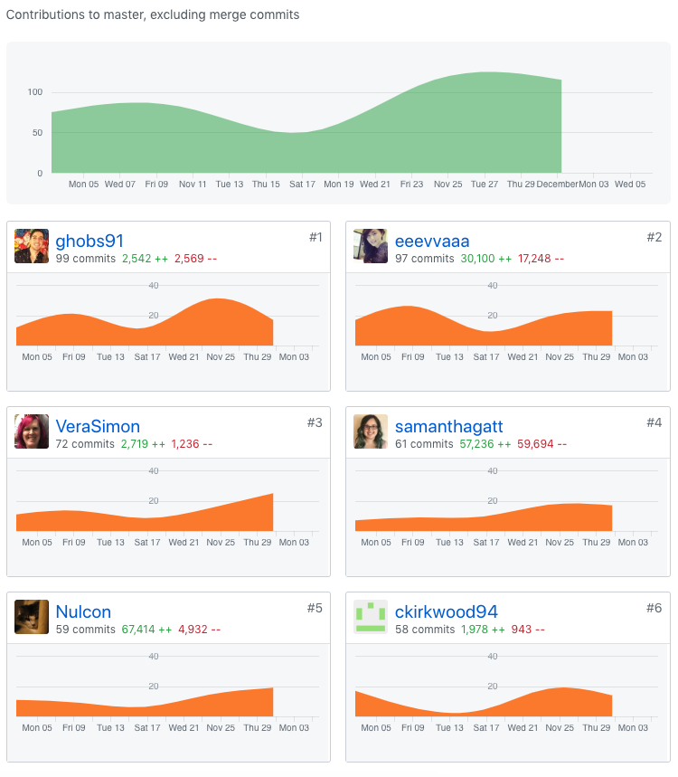

Part 1 - Individual Accomplishments this Week

###

Paste your team’s github contribution graph here and indicate your Github Handle:
https://github.com/Lambda-School-Labs/Labs8-OfflineReader/graphs/contributors

Provide a paragraph (5-8 sentences) summarizing the work you did this week, the challenges you faced, the tools you used, and your accomplishments

###

This week started off strong, we have gotten everything working and was thinking it would be clean up week and making things look pretty.
However, everything seems to crumble the last minute. With organization comes more issues, they just keep coming up one after another.
I know everyone is working really hard to pull this together, it definitely gets us down when things are not where they are supposed to be by check-in.
And also not being able to provide a solid endpoint to the iOS team.

###

Tasks Pulled

List the tasks you pulled this week, and provide a link to the successfully merged PR completing that task and the trello card for that task. You must have at least one front end and one back end. The expected total is 6 with a minimum of 4.

#### Frontend

- Ticket 1 Initial PWA

  - [Github](https://github.com/Lambda-School-Labs/Labs8-OfflineReader/pull/114)
  - [Trello](https://trello.com/c/YS2WhiuP)

- Ticket 2 Payment page styling

- [Github](https://github.com/Lambda-School-Labs/Labs8-OfflineReader/pull/102)
- [Trello](https://trello.com/c/t4ZuH42Y)

#### Backend

- Ticket 1 Organize URLs in backend

  - [Github](https://github.com/Lambda-School-Labs/Labs8-OfflineReader/pull/121)
  - [Trello](https://trello.com/c/ilIwQxFk)

- Ticket 2 Add video and audio fields to pages

  - [Github](https://github.com/Lambda-School-Labs/Labs8-OfflineReader/pull/117)
  - [Trello](https://trello.com/c/xMI7gm4Q)

###

Detailed Analysis

Pick one of your tickets and provide a detailed analysis of the work you did. This should be approximately ¼ page of text, and at least three screenshots.

###

Backend Ticket 1 Organize URLs in backend

###

We re-organized all the urls. Changed everything to path and includes and made an new app to organized authentication.
I have added user id to the pages article table. I named it user_id, and in my local Postgres database, the column became user_id_id.
By adding db_column=user_id as an attribute to ForeignKeyField, the issue was fixed.
The mostly challenging part after that was displaying artcles that are saved based on the current logged in user.
First went the approve of making a request getting the currently user information back, and match that with the user_id in the pages article table.
My blocker was not being able to access the current user id key value.

###

Part 2 - Milestone Reflections

Put your response to the weekly question and a link to your team journal assignment here.

- https://docs.google.com/document/d/1XzUVkLkvUvksw3nAFLcz3RKa7zGzvaUsoksuTKDHjdU/edit?ts=5be2f8bd
- https://anywhere-reader-test.netlify.com/
- https://anywhere-reader-test.herokuapp.com/

###

[Whiteboard Interview: Merging Two Packages](https://youtu.be/mjiEI0qIOsU)
