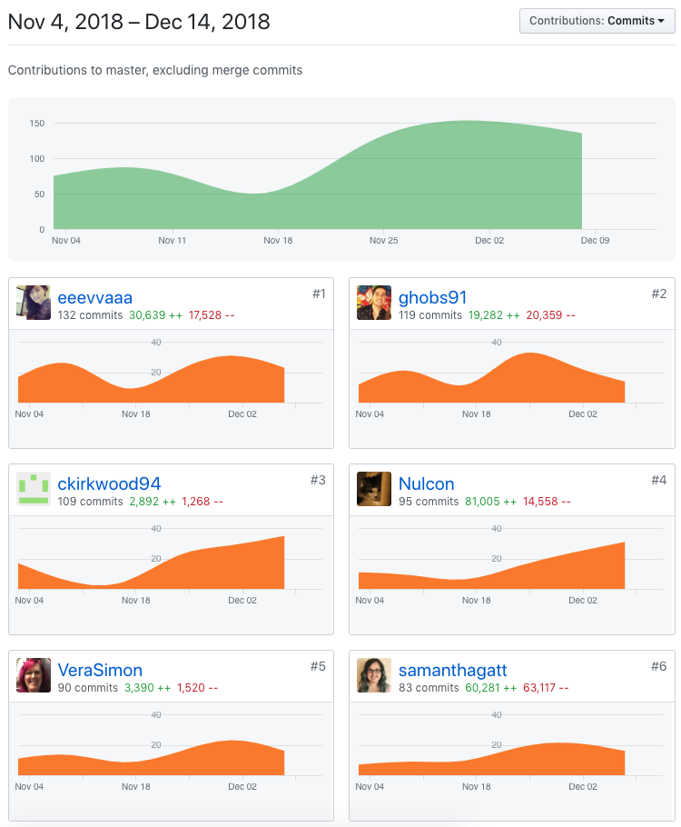
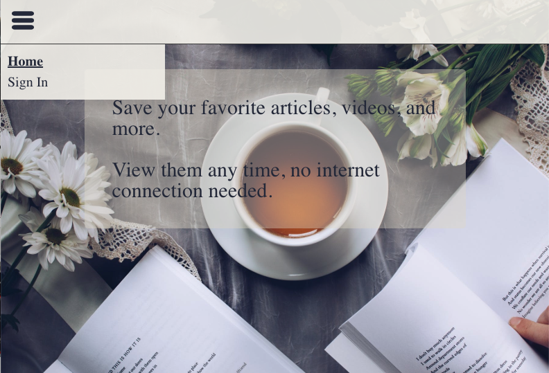

Part 1 - Individual Accomplishments this Week

###

Paste your team’s github contribution graph here and indicate your Github Handle:
https://github.com/Lambda-School-Labs/Labs8-OfflineReader/graphs/contributors

Provide a paragraph (5-8 sentences) summarizing the work you did this week, the challenges you faced, the tools you used, and your accomplishments

###

The whole team definitely pulled the project together. All functionalities have been implemented, and we spend most of the week working on polishing the UI.
Styled navigation and hamburger menu. Added toggle to the hamburger menu.
Implemented responsive design, all components scale according to browser width.
Setting page styling, and made username and email fields read only. The only two fields the user would be able to edit are first and last name.
Made two subscription options and integrated them to Stripe.
Added svg files to assets and keeping codes relatively clean and organized.
We still have some codes that we need to clean up, but would like to do that once we have all moving parts together, tested and merged to master.
Updated JSON format documentation.

###

Tasks Pulled

List the tasks you pulled this week, and provide a link to the successfully merged PR completing that task and the trello card for that task. You must have at least one front end and one back end. The expected total is 6 with a minimum of 4.

#### Frontend

- Ticket 1 Setting page styling

  - [Github](https://github.com/Lambda-School-Labs/Labs8-OfflineReader/pull/161)
  - [Trello](https://trello.com/c/kP3yobPg)

- Ticket 2 Landing page styling

- [Github](https://github.com/Lambda-School-Labs/Labs8-OfflineReader/pull/148)
- [Trello](https://trello.com/c/qaAOuYrS)

- Ticket 3 Styling Navigation Menu

  - [Github](https://github.com/Lambda-School-Labs/Labs8-OfflineReader/pull/172)
  - [Trello](https://trello.com/c/NlBWwSra)

- Ticket 4 Making styling for url input and search input responsive

  - [Github](https://github.com/Lambda-School-Labs/Labs8-OfflineReader/pull/182)
  - [Trello](https://trello.com/c/9KIU6sCi)

#### Backend

- Ticket 1 Payment page styling and subscription options

  - [Github](https://github.com/Lambda-School-Labs/Labs8-OfflineReader/pull/163)
  - [Trello](https://trello.com/c/3akWCyzQ)

### Detailed Analysis

Pick one of your tickets and provide a detailed analysis of the work you did. This should be approximately ¼ page of text, and at least three screenshots.

### Frontend Ticket 3 Styling Navigation Menu

###

Our project is backend heavy, and with learning new tech stacks on the fly, I think we did really well.
Since we are quite familiar with CSS and styling with styled components, I didn't think it would take me so long to style the nagivation component.
First blocker I ran into was making text-decoration as none for the NavLinks. It took some pair programming, but we were able to hash it out fairly quickly.
Then came toggling active class for the Navlinks. I was able to get it working by stying it like this: styled(NavLink).attrs({ activeClassName: activeLink }).
It was working, until the sign in Navlink got moved to a container component and toggle to sign out once a user signed in.
Fortunately, Caleb was able to come up with a solition which makes a lot of sense by moving the rest to the Navlinks to the contianer component, so that they could be styled together.
When styling the hamburger menu, I found that I was actually quite rusty with CSS. Did a lot of searching, and couldn't seem to find a way to do onclick with styled component.
So I ended up making a state and flag hamburger as false for the initial state, and toggle it between true and false when clicking on the menu button.
It was definitely a wake up call that I need to be practicing what I learned frequently. It also reminded me that I need to be doing searches effectively.

###

Part 2 - Milestone Reflections

Put your response to the weekly question and a link to your team journal assignment here.

- https://docs.google.com/document/d/1XzUVkLkvUvksw3nAFLcz3RKa7zGzvaUsoksuTKDHjdU/edit?ts=5be2f8bd
- https://anywhere-reader-test.netlify.com/
- https://anywhere-reader-test.herokuapp.com/

###
